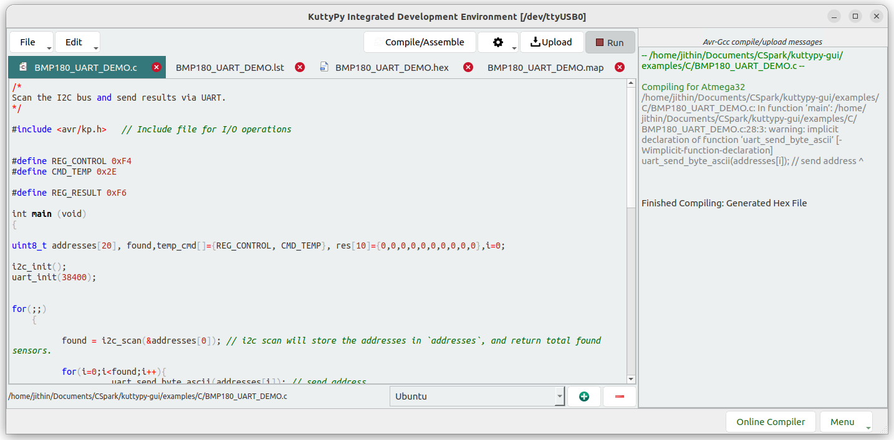
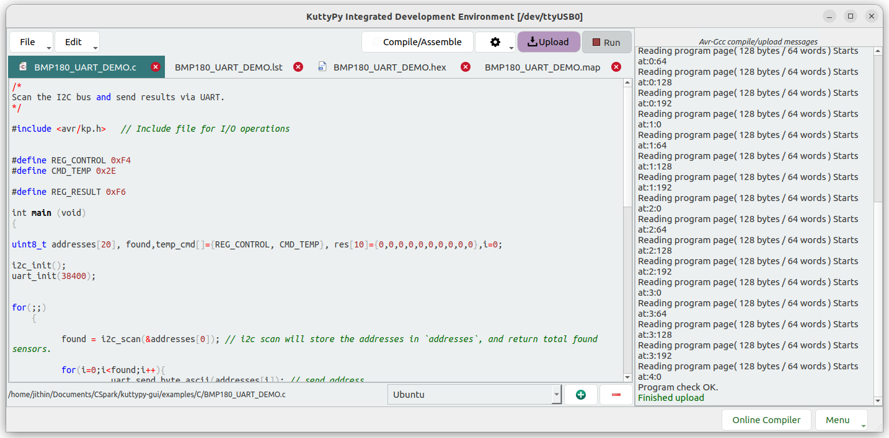
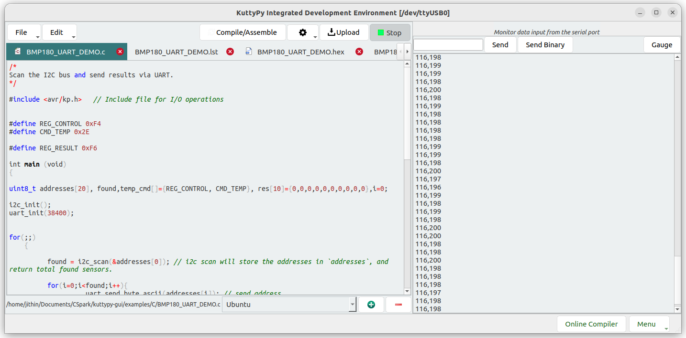

# The IDE

Kuttypy software has an IDE with many examples for learning embedded systems

## Examples

* [BMP180 Sensor](programming/BMP180.md) : Read values from a BMP180 sensor and dump them to the serial port.
* [MPU6050 Acceleromater](programming/MPU6050.md) : Read values from a MPU6050 accelerometer sensor and dump them to the serial port.

and many more...

## Controls

!!! tip "PROCESS"
	* Compile
    * Upload
    * Run

!!! info "Compilation"
	This uses the AVR-GCC compiler to create a hex file. the map and lst files are also shown in new tabs
	

	* If you used the deb file to install, the settings icon next to the compile button should be set to link the global kplib.

		The include statement will look like `#include <avr/kp.h>`

	* If however, you used pip, or are running from source, the kp.h and kplib.a files are stored in the examples directory, so select the Local KPlib option which automatically adds compile arguments pointing to the correct path.

		The include statement must be changed to `#include "kp.h"` to use the local version.

!!! info "uploading"
	Upload the compiled hex file to the hardware. 
	

!!! info "executing"
	Execute the uploaded program. Any information sent by the firmware over UART is shown in the serial monitor(38400 BAUD)
	
	
	More about [serial monitoring here](../programming/c/)
