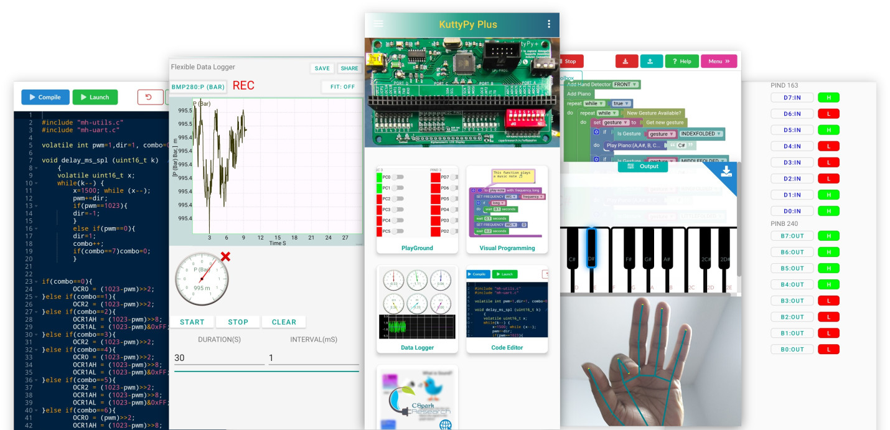
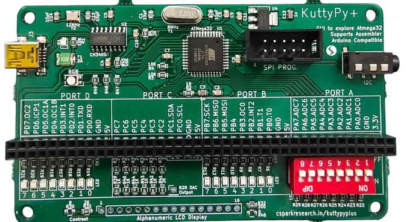

{: style="position:relative;left:0px;right:0px;"}

## About this 2 Day Workshop

`Tutorial for learning to use KuttyPy - A fun tool to learn science and electronics.`

!!! info ""
	{: style="position:relative;left:0px;right:0px;"}

!!! tip "You will need"
	* A kuttypy Device (Shown in the photo above)
	* A USB Mini B cable
	* An OTG cable : used to connect the Usb cable of the KuttyPy to your Android phone

!!! info "Intended audience"
	* Students who want to learn to code. This workshop will cover all basic concepts using Visual Programming. So there's no need to be scared of syntax and typing.
	* Beginners who would like to explore microcontroller functions via the android app
	* Hobbyists who want a way to control external parameters such as lights, fans, and [robots](../programming/intro/#slightly-complex-example) from their Visual programs.
	* Citizen Scientists who want to use affordable and [easily available sensors](../sensors) for physical parameters( temperature, humidity, pressure...) without having to learn embedded systems and communications.
	
	

For more information about the device, you can visit the [Manufacturer's page](https://csparkresearch.in/kuttypyplus)

## Software Installation 

The Android App is available on the [Google Play Store](https://play.google.com/store/apps/details?id=com.cspark.kuttypy)

After downloading , simply launch the app, and connect the KuttyPy device to your phone using the OTG cable
and the USB mini Cable.

!!! tip "Granting permissions to access the device"
	The phone will show a popup window asking you to grant permissions to access 'CH240 Serial Port'. Click OK.
	Once the connection is successful, the titlebar of the app will turn from <span style="color:red">RED</span> to <span style="color:green">GREEN</span> in color.

## The KuttyPy App


There are four significant parts to this app. You can select the tile/icon as per the task at hand.

+ Playground
+ Visual Programming
+ Data Logger
+ Code Editor

The Playground is a simple way to read each input of the KuttyPy board. Inputs in HIGH state are shown in GREEN, and LOW state is shown in RED.
It can also be used to measure voltage from the PORTA pins( PA0 to PA7). 

The Visual Programming window is where we will spend most of our time for this workshop. It is an interface where
you can drag and drop logical blocks to assemble simple programs to complex things like gesture controlled games.

The data logger is used to record information from various sensors which use the I2C inteface to communicate with the KuttyPy
device. It is a useful tool to study variations in physical parameters such as humidity, luminosity, air pressure etc.

Code editor is used to write programs in the C language. We may touch upon this part by the end of the workshop. Once you understand
how to control microcontrollers through `registers`, you will eventually need to learn to write programs in C. 


## The kuttypy device

You have noticed that there are many things on the circuit board such as ICs, LEDs, switches, connectors etc .
Your instructor will explain these, and their funtions

USB Connector : A Mini B type USB socket which is used to connect the kuttypy to other device.
500mA Fuse: A fuse protects devices from excess current flow. It will automatically cut off supply when the current goes above 500mA, and will restore the connection when the current reduces.
Microcontroller: ATMEGA32 . The brain of the device. Contains CPU, RAM, STORAGE, and INPUT OUTPUT pins
LEDs : There are many LEDs on this board. A Power LED , An RGB LED , and 16 LEDs connected to pins of the microcontroller which will let you blink them by writing programs.
SWITCH : there is a red coloured package containing 8 sliding switches. Each of these is connected to a pin from PORTA (PA0 pin to PA7). It is an input device.


## Visual Programming

### Hello World


## Explore the functions

* You have already noticed that the User Interface(UI) resembles the kuttyPy board. 
* It has four ports `PORTA, B , C, D` with 8 pins each, and each pin has a row representing it: 
---
* Each Pin is configured as an input by default, and the RED coloured box next to it indicates the input is `LOW` or near 0 Volts.
    * If the input is `HIGH`, which can be accomplished by connecting it to 5V, or enabling the `pull-up` checkbox, the RED box will turn to `GREEN`
    * Since the inputs are `floating`, merely touching the pins with your fingers will cause the inputs to fluctuate between `RED` and `GREEN` status. 
---
* Each pin can be reconfigured as an `OUTPUT` type by clicking on the `INPUT` button next to it.
    * Make any of the pins `PD5`, `PD7`, or `PB3` an output type, and click on its square RED button to set it to `HIGH`. These pins are connected to the RGB LED on the board, so the LED will glow!


## Hello World


### Introduction to Registers


Programs executing on Microcontrollers use [special function registers(SFRs)](../programming/basics) to manipulate the hardware(Inputs, outputs, ADCs etc). 
These are basically predefined variables, where each bit is associated with a hardware change.

??? tip " Binary conversion example "
	{: style="width:100%"}

setReg and getReg Python function calls in the kuttyPy library can be used to read and write these registers.
Here's an example. Run it in a python3 shell. 

```python
from kuttyPy import * #Import the library. also automatically connects to any available kuttypy hardware.
setReg('DDRD',160) #0b10100000 PD7(BLUE LED) and PD5(GREEN LED) made output type
setReg('PORTD',160) # PD5 and PD7 set to HIGH. Both LEDs start glowing. Colour looks like cyan.
```

For detailed examples, visit the [python coding page](../programming/intro).

You may skip to the [I/O examples](../programming/basics) page which will cover the following topics:

* Turning on an LED connected to any PIN

* Reading a voltage from an ADC enabled PIN

* Plotting with Matplotlib

* Using the iPython console

* Reading from I2C sensors


!!! note "Exercise : Python script for digital I/O"
	* Write a python script to make PD5 and PD7 output type.
	* Set PD5 HIGH (Green LED will glow)
	* wait half a second ( time.sleep(0.5) )
	* Set PD7 also HIGH. (Blue and Green will glow. resulting colour is Cyan )
	* wait half a second ( time.sleep(0.5) )
	* Set both LOW. (Nothing glows)

---    
* Some pins have additional functionality:
    * Analog to Digital Convertor enabled inputs: 
        * All pins on `PORTA (PA0 - PA7)` for this microcontroller have a 10-bit ADC functionality. 
        * Make it an `OUTPUT`, and click again to see a variable slider and an LCD number show a value between 0-1023  
        * You can use this as an [8 channel, 0-5V voltmeter](../adc) for testing analog joysticks, sensors etc.  Click on the LCD number to reveal a gauge and data logger!
    * PWM outputs. PB3, PD5, PD7 . Adjust the RGB LED intensity using the sliders. 
    

!!! note "Exercise : Python script for reading ADC"
	* Enable ADC on PA0 via the graphical interface.
	* Click on the LCD display, and from the dialog, check 'show register manipulations'
	* Note the registers being written and read
	* Disable the ADC (Set to input)
	* `Go to the scripting tab, and write a program to read 10 values from PA0`

!!! tip "Stuff seems to be working?"
    Now that we have skimmed over the basics of the graphical utility's `playground`, it would appear that the board is capable
    of controlling real-world events from Python. For further details on the hardware schematic, [visit the page](../hw/) .
    
    The pinout diagram will be very useful although the board itself is well labelled. The ATMEGA32 datasheet will be handy as well.


---

## Sensors using I2C communication

[Skip to the relevant page](../sensors/)

* [I2C Sensors](../sensors) for a range of physical parameters such as pressure, acceleration etc can be connected using PC0(SCL), and PC1(SDA).
* Use the graphical interface to scan for sensors and view readings
* Check out functionality, and explore potential applications.
* Write Python code to read data from an accelerometer.

!!! note "Sensors Exercise : Write a python program to read data from an accelerometer"
	* The complete [docs are here](../programming/i2c) .
	* `MPU6050_init()`
	* `values = MPU6050_all()`
	* Using the above two functions, one can get data from this sensor, where `values` is a 7 item long list. 
	* [Ax, Ay, Az, T, Gx, Gy, Gz] . A = acceleration. G = angular velocity

!!! note "Sensors Exercise #2: Plot 200 values from MPU6050 (Ax) using matplotlib"
	* `pip3 install matplotlib` or `py -3 -m pip install matplotlib`
	* The complete [docs are here](../programming/i2c) .
	```python
	from kuttyPy import *
	from matplotlib import pyplot as plt
	MPU6050_init() #Initialize the sensor
	points = 0
	for a in range(200):
		x = MPU6050_all() #Fetch readings
		if x is not None:
			plt.scatter(points,x[0])
			points +=1
		plt.pause(0.01) #10ms delay.
	```
	* Replace the x-axis with timestamps instead of point numbers.
	* Store 200 values, and timestamps in two lists, and plot using `plt.plot(x[],y[])` and `plt.show()`

!!! note "Sensors Exercise #3: Extract the oscillation frequency from the data using scipy's leastsq fitting "

	```python
	import numpy as np
	from scipy import optimize
	#-------------------------- Fourier Transform ------------------------------------
	def fft(ya, si):
		'''
		Returns positive half of the Fourier transform of the signal ya. 
		Sampling interval 'si', in Seconds
		'''
		NP = len(ya)
		if NP%2: #odd number
			ya = ya[:-1]
			NP-=1
		v = np.array(ya)
		tr = abs(np.fft.fft(v))/NP
		frq = np.fft.fftfreq(NP, si)
		x = frq.reshape(2,int(NP/2))
		y = tr.reshape(2,int(NP/2))
		return x[0], y[0]    

	def find_frequency(x,y):		# Returns the fundamental frequency using FFT
		tx,ty = fft(y, x[1]-x[0])
		index = find_peak(ty)
		if index == 0:
			return None
		else:
			return tx[index]

	def sine_eval(x,p):			# y = a * sin(2*pi*f*x + phi)+ offset
		return p[0] * np.sin(2*np.pi*p[1]*x+p[2])-p[3]

	def sine_erf(p,x,y):					
		return y - sine_eval(x,p)


	def fit_sine(xa,ya, freq = 0):	# Time in S, V in volts, freq in Hz, accepts numpy arrays
		size = len(ya)
		mx = max(ya)
		mn = min(ya)
		amp = (mx-mn)/2
		if freq == 0:						# Guess frequency not given
			freq = find_frequency(xa,ya)
		if freq == None:
			return None
		#print 'guess a & freq = ', amp, freq
		par = [amp, freq, 0.0, 0.0] # Amp, freq, phase , offset
		par, pcov = optimize.leastsq(sine_erf, par, args=(xa, ya))
		return par

	####
	#### YOU NEED TO WRITE CODE TO COLLECT data points and store timestamps to `TIMESTAMPS` 
	#### and values to `DATAPOINTS` here.
	####

	results=fit_sine(TIMESTAMPS,DATAPOINTS) #Returns : Amp, freq, phase , offset
	if results is not None:
			amp=abs(results[0])
			freq=results[1]
			print('Results: %5.2f amp, %5.3f Hz<br>'%(amp,freq))
	
	
	```

---


## Basic C code

All the register manipulation commands issued by Python running on your laptop are interpreted by a bootloader firmware
executing on the microcontroller. In addition to this, you can also compile C code, and flash it to the remaining storage space
on the microcontroller, thereby making it independent and capable of functioning from any 5V power supply.

[Relevant section](../programming/c)

!!! note "Exercise : C program for digital I/O"
	* Write a C program to make PD5 and PD7 output type.
	* Set PD5 HIGH (Green LED will glow)
	* wait half a second ( delay_ms(500); imported from "mh-utils.c" )
	* Set PD7 also HIGH. (Blue and Green will glow. resulting colour is Cyan )
	* wait half a second ( delay_ms(500); imported from "mh-utils.c" )
	* Set both LOW. (Nothing glows)
