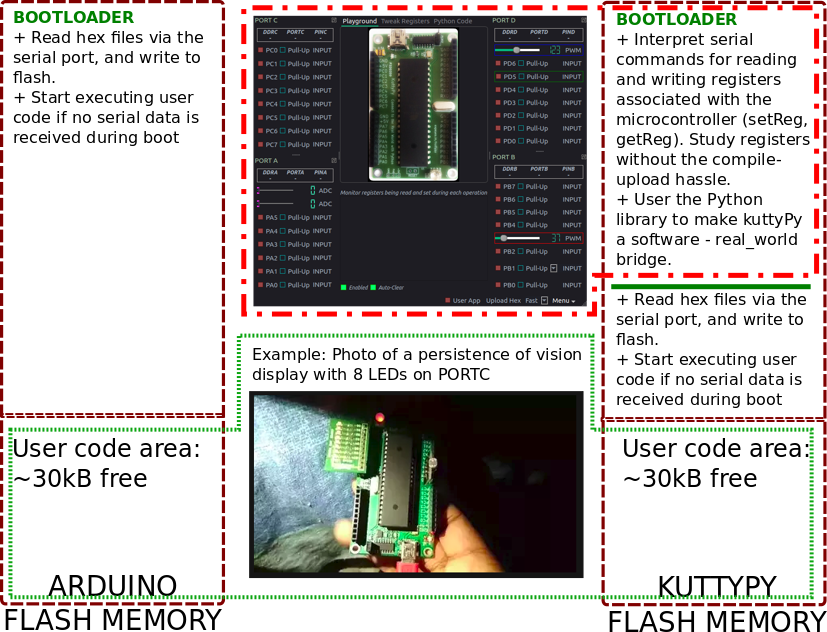

# The kuttyPy firmware

This is based on the optiboot bootloader, and has added functions for Registry R/W .
The bootloader's programming functions are retained, and in addition, the kuttyPy
while in bootloader mode can toggle register values.
 

