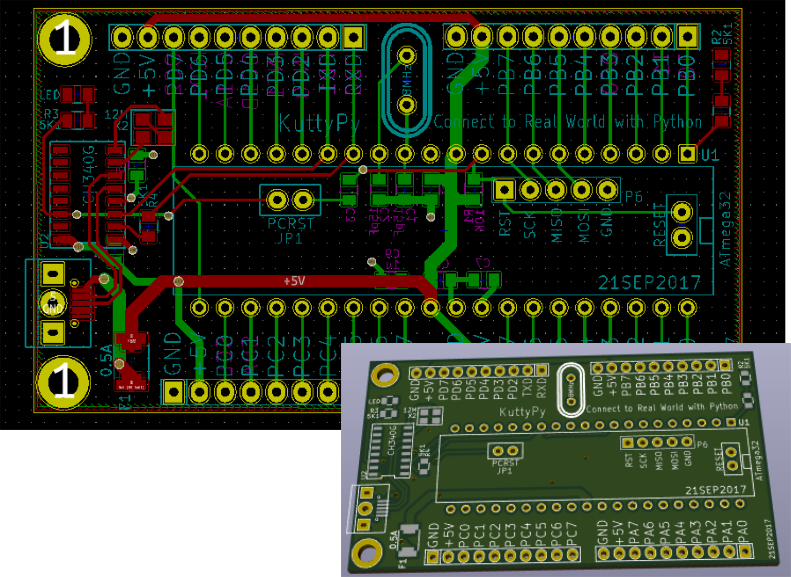

# The kuttyPy Hardware

The schematic is relatively simple. It contains

+ An ATMEGA32 processor
+ A USB-Serial bridge IC
+ A common cathode RGB LED with R,G,B pins connected to PB3, PD5, PD7 (All 3 have PWM) 
+ Some components such as crystals and capacitors 
+ Each port is cleanly broken out into 10 pin berg sockets, and labelled properly
+ There is also a PCRST jumper which can be removed if the bootloader is no longer needed.

## Schematic

## Layout

## Pinout diagram

!!! note "Pinout diagram for ATMEGA32 + KuttyPy specific connections"
	
