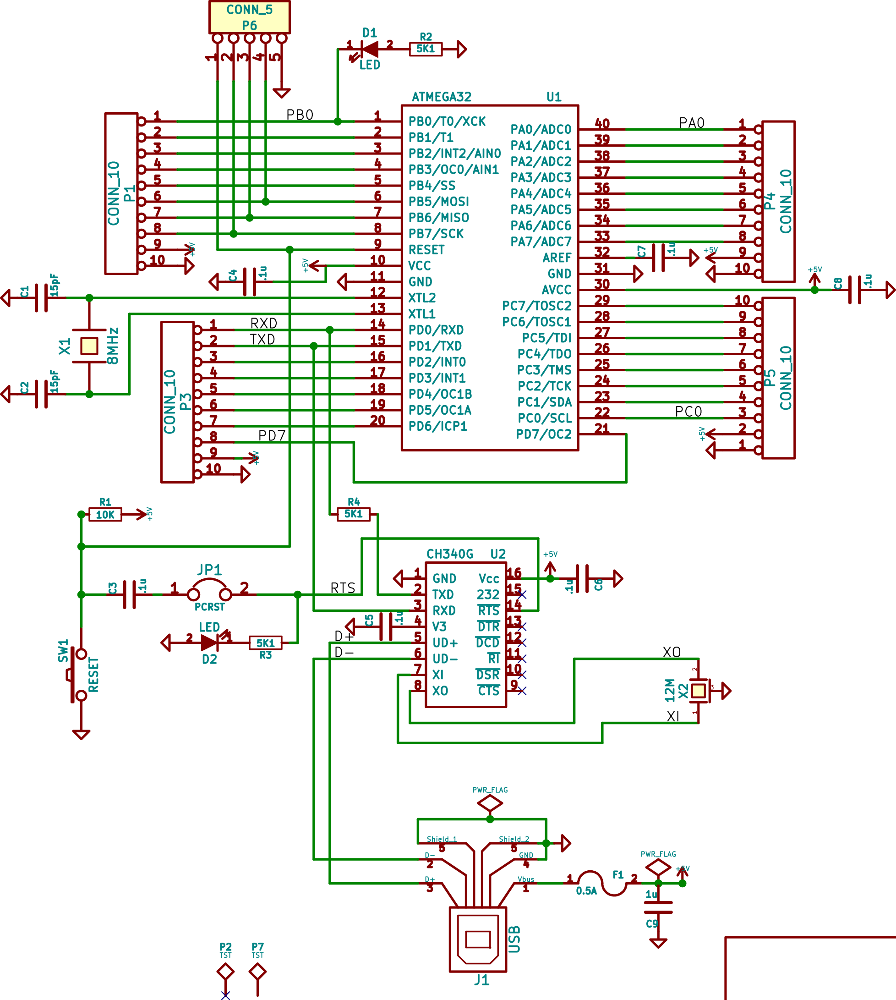
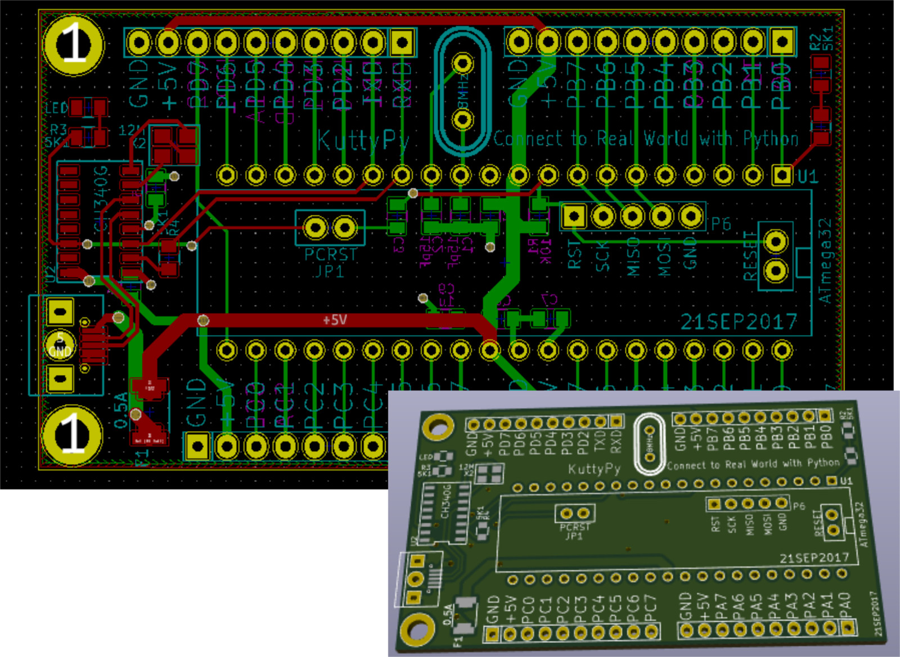
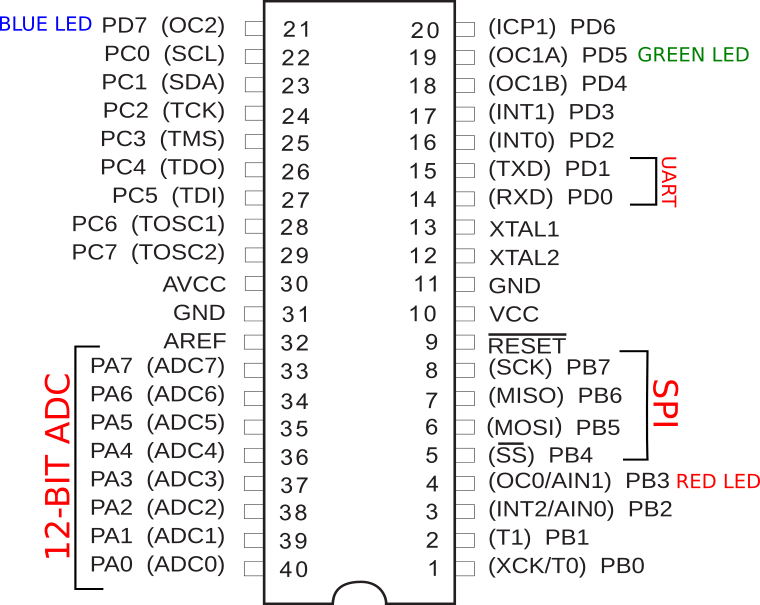

# The kuttyPy Hardware

The schematic is relatively simple. It contains the following parts :

+ An ATMEGA32 processor
+ A USB-Serial bridge IC
+ A common cathode RGB LED with R,G,B pins connected to PB3, PD5, PD7 (All 3 have PWM) 
+ Some components such as crystals and capacitors 
+ Each port is cleanly broken out into 10 pin berg sockets(8x I/O pins, 5V, GND), and labelled properly
+ There is also a PCRST jumper which can be removed if the bootloader is no longer needed.

## Schematic

## Layout

## Pinout diagram

!!! note "Pinout diagram for ATMEGA32 + KuttyPy specific connections"
	

Hardware designs are licensed under OHL, and KiCAD files can be downloaded from 
[the creators](https://github.com/expeyes/expeyes-programs/tree/ce092cb83bac42a7f1cceb7135c07d05127cf616/kuttyPy/hardware) 
