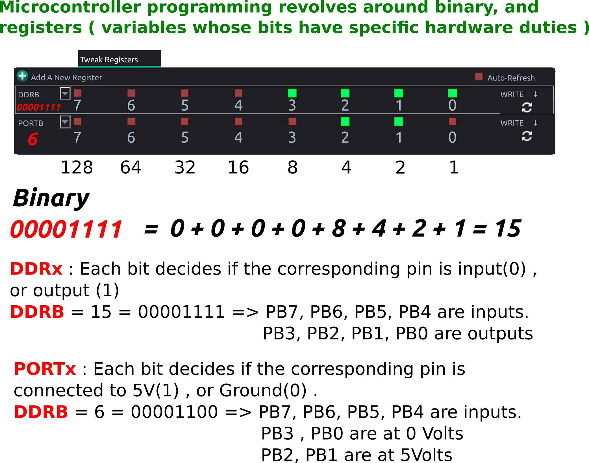

# Reading and writing special function registers

Features of microcontrollers ranging from I/O operations to ADC reading and I2C communications are all configured by toggling and reading bits in variables called Special Function Registers (SFR)

The graphical utility makes these changes based on user input, but explicitly displays in the log, the REGISTER values that were toggled.

In the ATMEGA32 microcontroller, the DDRB register (Data direction Register for B pins PB0 - PB7) , is used to set which pins on Port B are output, and which are input. This can be done by writing an 8-bit number(0 - 255) to DDRB , where each bit controls one of the pins from PB0 to PB7. 

DDRB = 255 (binary 11111111) implies all pins will be output type. DDRB = 160 (101000000) implies PB7 and PB5 will be output type, and rest will be input.

Similarly, PORTB register is used to turn an output HIGH(5V), or LOW(0V/Ground)

PB5 and PB7 set to Output type (DDRB=160), and made HIGH(PORTB=160).

You may also manipulate registers with [simple code snippets](../programming/basics)

!!! tip "Relevance of Binary"
	

