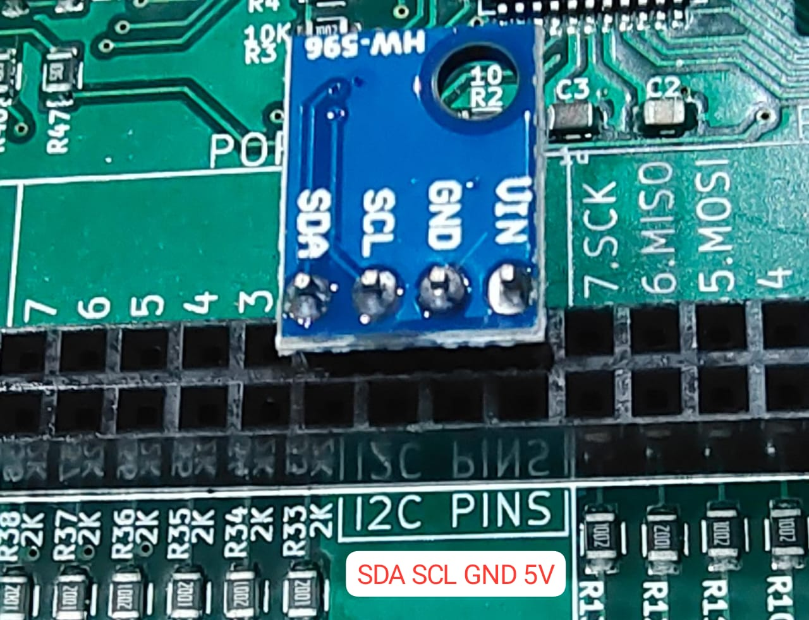

## BMP180 sensor

 Read values from a BMP180 sensor and dump them to the serial port.

For connection details [refer here](/programming/i2c)




The code

!!! tip "examples/C/BMP180_UART_DEMO.c"
	```python
	/*
	Scan the I2C bus and send results via UART.
	*/
	
	#include <avr/kp.h>   // Include file for I/O operations
	
	
	#define REG_CONTROL 0xF4
	#define CMD_TEMP 0x2E
	
	#define REG_RESULT 0xF6
	
	int main (void)
	{
	
	uint8_t addresses[20], found,temp_cmd[]={REG_CONTROL, CMD_TEMP}, res[10]={0,0,0,0,0,0,0,0,0,0},i=0;
	
	i2c_init();
	uart_init(38400);
	
	
	for(;;)
	    {
	
		found = i2c_scan(&addresses[0]); // i2c scan will store the addresses in `addresses`, and return total found sensors.
	
		for(i=0;i<found;i++){	
			uart_send_byte_ascii(addresses[i]); // send address
			uart_send_byte(','); // send comma.
	
			//BMP180 detected at 119 (0x77). read values from it and send over UART
			for(;addresses[i] == 0x77;){
					delay_ms(10);
					// write to 0x77 (bmp180 address) , 0xF4 and 0x2E
					i2c_write(0x77 , &temp_cmd[0], 2); // init temperature measurement
					delay_ms(10);
					// read 2 bytes from the result register
					i2c_read(0x77, REG_RESULT, &res[0],2);
	
					uart_send_byte_ascii(res[0]); // send MSB
					uart_send_byte(',');
					uart_send_byte_ascii(res[1]); // send LSB
					uart_send_byte('\n');
					//  rawT = (res[0] << 8) + res[1]
				          //  a = c5 * (rawT  - c6)
	                            // Temperature = a + (mc / (a + md))
	
					// sample values. loaded from the chip: 
					// c5 = 0.004824447631835938 
					// c6 = 20636.0 
					// mc = -942.88
					// md = 16.50625
	
				}
	
			
	
			}
		if(found)
			uart_send_byte('\n');
	          delay_ms(500);
	
	  }
	
	return 0;
	}
	```

## Example calculations

The BMP180 hardware contains a dozen calibration coefficients which must be read and stored before acquiring data.
We have avoided this step to avoid complicating the program, and have instead provided sample values for the
temperature measurement process.

```bash
c5 = 0.004824447631835938 
c6 = 20636.0 
mc = -942.88
md = 16.50625
```

Sample calculation for raw values 116(MSB), 196(LSB) . 

<pre><font color="#008700">In [</font><font color="#33DA7A"><b>2</b></font><font color="#008700">]: </font>(<font color="#008700">116</font>&lt;&lt;<font color="#008700">8</font>) + <font color="#008700">196</font>
<font color="#870000">Out[</font><font color="#F66151"><b>2</b></font><font color="#870000">]: </font>29892

<font color="#008700">In [</font><font color="#33DA7A"><b>3</b></font><font color="#008700">]: </font>rawt= (<font color="#008700">116</font>&lt;&lt;<font color="#008700">8</font>) + <font color="#008700">196</font>

<font color="#008700">In [</font><font color="#33DA7A"><b>4</b></font><font color="#008700">]: </font>a = <font color="#008700">0.00482444</font>*(rawt - <font color="#008700">20636</font>)

<font color="#008700">In [</font><font color="#33DA7A"><b>5</b></font><font color="#008700">]: </font>a
<font color="#870000">Out[</font><font color="#F66151"><b>5</b></font><font color="#870000">]: </font>44.65501664

<font color="#008700">In [</font><font color="#33DA7A"><b>6</b></font><font color="#008700">]: </font>a+(-<font color="#008700">942</font>/(a+<font color="#008700">16.506</font>))
<font color="#870000">Out[</font><font color="#F66151"><b>6</b></font><font color="#870000">]: </font>29.253048985591825
</pre>