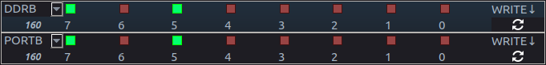
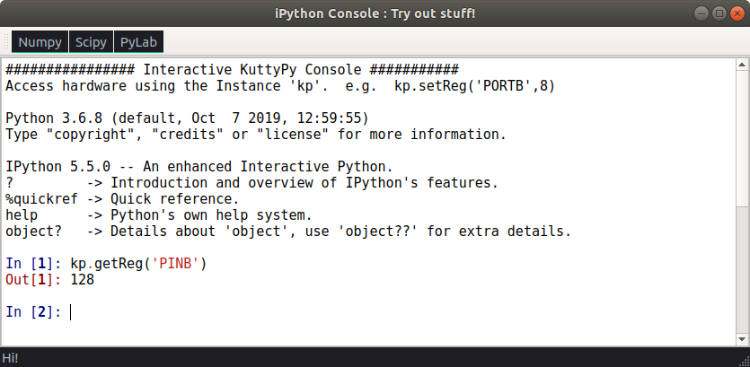

# Reading and writing special function registers

Features of microcontrollers ranging from I/O operations to ADC reading and I2C communications are all configured by toggling and reading bits in variables called Special Function Registers (SFR)

For example, in the ATMEGA32 microcontroller, the DDRB register (Data direction Register for B pins PB0 - PB7) , is used to set which pins on Port B are output, and which are input. This can be done by writing an 8-bit number(0 - 255) to DDRB , where each bit controls one of the pins from PB0 to PB7.

DDRB = 255 (binary 11111111) implies all pins will be output type. DDRB = 160 (101000000) implies PB7 and PB5 will be output type, and rest will be input.

Similarly, PORTB register is used to turn an output HIGH(5V), or LOW(0V/Ground)



PB5 and PB7 set to Output type (DDRB=160), and made HIGH(PORTB=160).

### Test this with a simple code to turn on an LED connected to PB3

```python tab="Python Code"
from kuttyPy import *   # automatically connects to an available device.
setReg('DDRB',8) # PB3 made output. 0b00001000 = 8
setReg('PORTB', 8) #PB3 to 5 Volt supply. RED LED turns on
```

```C tab="C equivalent" hl_lines="1"
/* Compile with AVR-GCC for atmega32, and upload with avrdude/kuttypy-gui */
#include <avr/io.h>
int main (void) {
  DDRB = 8;		// Data Direction Register for port B
  PORTB = 8;    // PB3 HIGH
  }
return 0;
}
```

## Python Functions for basic register access

### setting and reading register values

```python tab="setReg" hl_lines="1"
def setReg(Register Name, Value)
writes a value to a REGISTER defined in the datasheet of the processor

  Register Name : a string representing the register. e.g. 'DDRB', 'ADMUX' etc
  Value: an integer between 0 and 255 , because atmega32 is an 8 bit microcontroller.
  return: True if success

```


```python tab="getReg" hl_lines="1"
def getReg(Register Name)
reads a value frm a REGISTER defined in the datasheet of the processor

  Register Name : a string representing the register. e.g. 'PINB', 'ADCL', 'ADCH' etc
  return: Contents of the register. an integer between 0 and 255

```

```python tab="example"  hl_lines="1"
# Read value from Analog to Digital converter(ADC) channel 0 (PA0)
from kuttyPy import *
setReg('ADMUX', (1<<6) | 0) #REF_AVCC | Channel 0
setReg('ADCSRA', 196)  #Set ADC conversion speeds, and enable it. Refer to the ATMEGA32 datasheet for details.
cl = getReg('ADCL')  #LSB 8 bits
ch = getReg('ADCH')  # MSB 2 bits
print( (ch<<8)|cl )  # Combine the two to make a 10 bit number, and print to the screen
```


You can also twiddle bits on various registers inside the "Registers" tab to watch
changes in real time. In the animation below, the ADC is being continuously read.


```python tab="readADC" hl_lines="1"
def readADC(channel)
reads a voltage value from the specified channel, and returns it

  channel : 0 to 7
  return: 10 bit number( an integer between 0 and 1023 )

```

```python tab="data logger example with matplotlib"  hl_lines="1"
# Read values from Analog to Digital converter(ADC) channel 5 (PA5), and plot them
import time
from kuttyPy import *
from matplotlib import pyplot as plt

setReg('ADMUX', (1<<6) | 5) #REF_AVCC | Channel 5
for a in range(50):
    setReg('ADCSRA', 196)
    cl = getReg('ADCL')
    ch = getReg('ADCH')
    plt.scatter(a, (ch<<8)|cl ,s=5)
    plt.pause(0.01) #Wait 10 mS
```

## Embedded iPython Console

In the scripting tab, there is an option to launch the ipython console. This
is a quick way to access the python functions from the GUI itself.
The kuttyPy instance in this window is called `kp` , so you can
use functions such as `kp.setReg` , `kp.MPU6050_init` etc.
TAB based autocompletion and inline help is also available.

!!! tip "Screenshot"
	


## Total list of defined registers for ATMEGA32

```python
UBRRL	= 0X29,
UCSRB	= 0X2A,
UCSRA	= 0X2B,
UDR	= 0X2C,
SPCR	= 0X2D,
SPSR	= 0X2E,
SPDR	= 0X2F,
PIND	= 0x30,		# Port D input
DDRD	= 0x31,		# Port D direction
PORTD	= 0x32,		# Port D output
PINC	= 0x33,
DDRC	= 0x34,
PORTC	= 0x35,
PINB	= 0x36,
DDRB	= 0x37,
PORTB	= 0x38,
PINA	= 0x39,
DDRA	= 0x3A,
PORTA	= 0x3B,
EECR	= 0X3C,
EEDR	= 0X3D,
EEARL	= 0X3E,
EEARH	= 0X3F,

TWBR    = 0X20,
TWSR    = 0X21,
TWAR    = 0X22,
TWDR    = 0X23,

ADCL	= 0X24,       # ADC data
ADCH	= 0X25,
ADCSRA	= 0X26,	# ADC status/control
ADMUX	= 0X27,    # ADC channel, reference
ACSR	= 0X28,


OCR2	= 0X43,		# Timer/Counter 2  Output Compare  Reg
TCNT2	= 0X44	,	# Counter2
TCCR2	= 0x45,		# Timer/Counter 2 control reg
ICR1L	= 0X46,
ICR1H	= 0X47,
OCR1BL	= 0X48,
OCR1BH	= 0X49,
OCR1AL	= 0X4A,
OCR1AH	= 0X4B,
TCNT1L	= 0X4C,
TCNT1H	= 0X4D,
TCCR1B	= 0X4E,
TCCR1A	= 0x4F,
SFIOR	= 0X50,

TCNT0	= 0x52	,	# Timer/ Counter 0
TCCR0	= 0x53,
MCUCSR	= 0X54,
MCUCR	= 0X55,
TWCR	= 0X56,
SPMCR	= 0X57,
TIFR	= 0X58,
TIMSK	= 0X59,
GIFR	= 0X5A,
GICR	= 0X5B,
OCR0	= 0x5C,
SPL	= 0X5D,
SPH	= 0x5E,
SREG	= 0X5F

```
