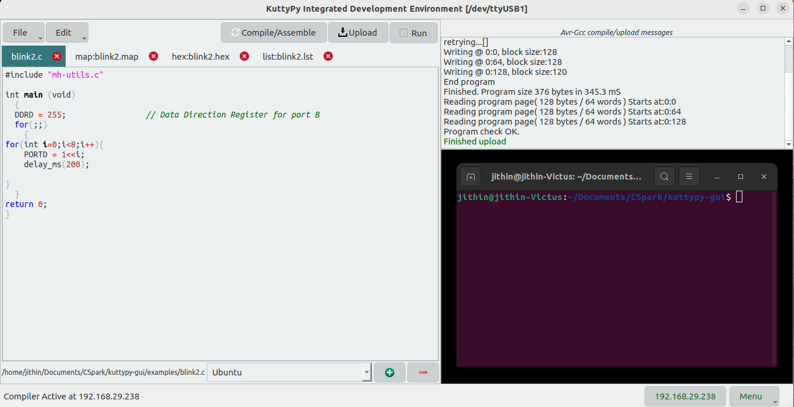

# Compiling and uploading C Code

The KuttyPy firmware also contains bootloader logic to enable uploading your own hex files.

!!! tip "Compiling and uploading C Code"
	

The above example toggles the first four pins of PORTB every 500mS. 

## Procedure

* First, open a C file
* Then, Compile and upload
* Finally, click on the 'user app' button to start execution of this uploaded code. The UI will be inaccesible until you uncheck the user app button.
	* If the software is closed, your uploaded code will automatically run.
	* If the kuttyPy simply receives a 5V power supply, your uploaded code will start running.

There are several examples supplied with KuttyPy for dealing with basic I/O,I2C, UART, Persistence of Vision
display, counters, timers etc.

!!! tip "Atmega32 Datasheet"
	You should probably [Download](http://ww1.microchip.com/downloads/en/devicedoc/doc2503.pdf) the datasheet 
	if you want to understand the functions of each register
 

## Compiling and uploading blink.c for kuttyPy
using the command line to compile with avr-gcc, and upload with avrdude. You can also use the graphical software. 

```bash
avr-gcc  -Wall -O2 -mmcu=atmega32 -Wl,-Map,blink.map -o blink blink.c
avr-objcopy -j .text -j .data -O ihex blink blink.hex
avrdude -b 38400 -P /dev/ttyUSB0 -pm328p -c arduino -U flash:w:blink.hex  #Verify if the device is ttyUSB0
```


## Code examples from microhope

The kuttyPy hardware is closely related to the microhope project, and code examples from Microhope can also be
compiled and uploaded for kuttyPy. However, since the bootloaders are different, the upload protocol 'arduino'
must be used.
