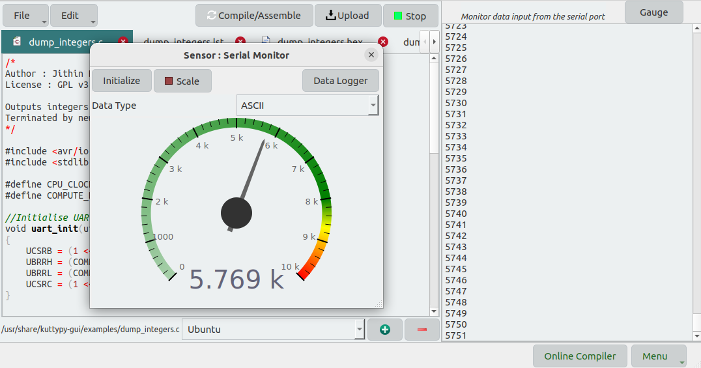

# Compiling and uploading C Code

The KuttyPy firmware also contains bootloader logic to enable uploading your own hex files.

!!! tip "Compiling and uploading C Code"
	

The above example shown in the KuttypyIDE blinks each LED on PORTB one by one,and loops indefinitely. 

## Procedure

* First, open a C file
* Then, Compile it, followed by upload if no errors.
* Finally, click on the 'RUN' button to start execution of this uploaded code. The UI will be inaccesible until you uncheck the user app button.
	* If the software is closed, your uploaded code will not automatically run, and a physical cable reconnect will be needed.
	* If the kuttyPy simply receives a 5V power supply, your uploaded code will start running.

There are several examples supplied with KuttyPy for dealing with basic I/O,I2C, UART, Persistence of Vision
display, counters, timers etc.

!!! tip "Atmega32 Datasheet"
	You should probably [Download](http://ww1.microchip.com/downloads/en/devicedoc/doc2503.pdf) the datasheet 
	if you want to understand the functions of each register
 
## IDE Features

The IDE includes tabbed browsing, and editing multiple files. It also displays the contents
of list,map, and hex files when you compile your code successfully. The `ONLINE COMPILER` launches a 
flask server, and displays an IP address. This IP address can be entered in the KuttyPy app
on an android phone on the same network, allowing it to compile code via this IDE.

The example below shows a program called `dump_integers.c` which outputs newline terminated
numbers from 1 to 10000 via the serial port. this is used to demonstrate the serial monitor.

!!! tip "Compiling and uploading C Code"
	

The raw values in the serial monitor are shown when the code is run, and a GAUGE is also
available to view these readings as an analog gauge. It can plot binary data, as well as parsed ASCII data.

!!! tip "Compiling and uploading C Code"
	

A data logger is built into the gauge, and this makes a plot of the values received over the serial port.

!!! tip "Compiling and uploading C Code"
	

## Compiling and uploading blink.c for kuttyPy

using the command line to compile with avr-gcc, and upload with avrdude. You can also use the graphical software. 

```bash
avr-gcc  -Wall -O2 -mmcu=atmega32 -Wl,-Map,blink.map -o blink blink.c
avr-objcopy -j .text -j .data -O ihex blink blink.hex
avrdude -b 38400 -P /dev/ttyUSB0 -pm328p -c arduino -U flash:w:blink.hex  #Verify if the device is ttyUSB0
```


## Code examples from microhope

The kuttyPy hardware is closely related to the microhope project, and code examples from Microhope can also be
compiled and uploaded for kuttyPy. However, since the bootloaders are different, the upload protocol 'arduino'
must be used.

[List of included C code](../c_examples)

## Integrating with the Arduino IDE

Go to file->preferences->additional boards manager of the Arduino IDE , and paste the following line

```python
https://scischool.in/kuttypy_arduino.json
```

Select Tools->board-> Kuttypyplus -> KuttypyPlus(ATMEGA32)

Now you can run the countless examples in the Arduino ecosystem on your KuttypyPlus as well.

+ sample compile output on the Arduino IDE

```bash

Archiving built core (caching) in: /tmp/arduino_cache_321166/core/core_kuttypy_avr_32_eeprom_keep,BOD_4v0,clock_8MHz_external_94bd17bffe2a8f3c71766d07311a0c7d.a
Sketch uses 840 bytes (2%) of program storage space. Maximum is 32256 bytes.
Global variables use 9 bytes (0%) of dynamic memory, leaving 2039 bytes for local variables. Maximum is 2048 bytes.

```