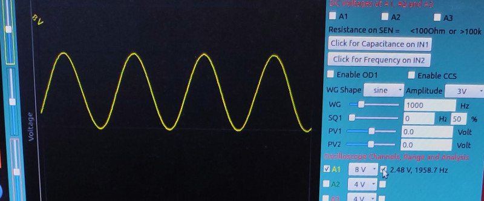
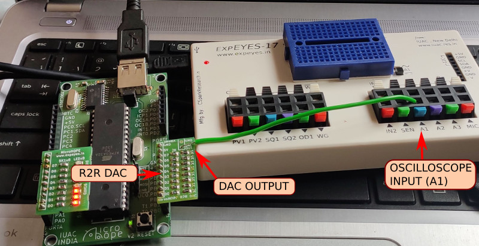

# C Code examples

There are several example programs to help you get started with coding in C. Some are described below.

## blink2.c

Alternately enables the first four pins of PORTB (PB0,PB1,PB2,PB3), and last four PORTB (PB4,PB5,PB6,PB7) every 500mS

```c
#include "mh-utils.c" //library containing the delay_ms function

int main (void)
  {
  DDRB = 255;		// Data Direction Register for port B. Make all 8 pins output type
  for(;;)
    {
    PORTB = 15;	 //0b00001111 . First four pins ON
    delay_ms(500); //wait for half a second.
    PORTB = 240;  //0b11110000 . Next four pins ON. First four OFF.
    delay_ms(500); 
  }
return 0;
}

```

## pov2.c

Make a persistence of vision display with 8 LEDs connected to PORTB.
It is currently designed to flash `KUTTYPY` , but can be modified easily to write anything.

!!! tip "Persistence of vision display"
	

	A persistence of vision display made with C code! Write text in thin air using 8 LEDs on PORTB.

## counter.c

counts input pulses on PB1 in 2 second intervals, and sends the results via UART to the serial monitor of kuttypy. BAUD rate 38400 8N1.

can only count up to 255, following which an overflow will occur, and it will start over from 0. For higher count rates, refer
to the next section on 16 bit timers.

!!! tip "Counters are useful for measuring frequencies, or signals from instruments such as Geiger counters"
## counter16bit_plaintext.c

counts input pulses on PB1 in 10 second intervals, and sends the results via UART to the serial monitor of kuttypy. BAUD rate 38400.

can count up to 65535 per interval, following which an overflow will occur, and it will start over from 0. The counts are parsed
into human readable text format, and sent via serial port. Each number is terminated by a newline character.

## stepper.c

control a stepper motor using firt four pins of PORTB. The program signals 360 steps clockwise, and then 360 backwards in a continuously oscillating fashion.
You can also [control stepper motors from the kuttyPy GUI](../../stepper)

## R2RDAC_wavegen.c

Create a sine wave generator using an 8 bit R2R DAC connected to PORTB. This program has its own page with results, images, and 
table creation code [here](../r2r_wavegen)

!!! tip "ExpEYES17 oscilloscope window showing the 0-5V waveform"
	
	Scipy based sine fitting reveals the frequency to be 1958.7Hz

!!! tip "KuttyPy with R2R DAC Connected to ExpEYES17 oscilloscope"
	

