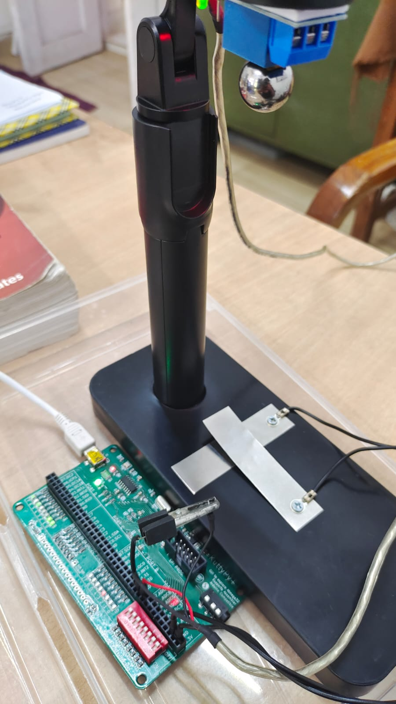
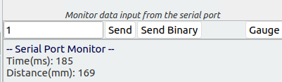

## Time of flight measurement

 * A 5V relay is opened, and the electromagnet is exposed. Its driver pin is connected to B0.
 * The program makes B0 HIGH, and therefore the electromagnet is energized.
 * The user now fixes this relay at a fixed height from the floor/table, and attaches
 * a small steel ball to it.
 * When the user sends binary number 1 via UART, the relay is turned off and the ball will automatically fall down. It should hit a contact switch made with 2 metal
 * plates connected between PA0 and GND.
 * The microcontroller starts a timer when the relay is turned off, and stops it when the contact switch
 * is triggered, thereby measuring the time taken for the ball to travel the known distance. 
 * Results are returned via the serial port




The code

!!! tip "examples/C/time_of_flight_uart.c"
	```c
	#include <avr/kp.h>
	#include <avr/interrupt.h>
	#include <string.h>
	#include <stdlib.h>
	
	#define PIN_RELAY 0
	#define RELAY_OFF   PORTB |= (1<<PIN_RELAY)
	#define RELAY_ON  PORTB &= ~(1<<PIN_RELAY)
	
	#define INPUT_HIGH  PINA&(1<<0)
	
	#define PIN_GREEN 5
	#define GREEN_ON   PORTD |= (1<<PIN_GREEN)
	#define GREEN_OFF  PORTD &= ~(1<<PIN_GREEN)
	
	
	int main(void)
	{
	char buffer[50],cnt;
	uint32_t x;
	double distance=0;
	
	uart_init(38400);
	DDRA=0;  PORTA=1; //input. switch for detecting ball
	DDRB=1; // output. for controlling the relay
	
	DDRD=(1<<PIN_GREEN);
	
	while(1){
		RELAY_ON;
		while(!(UCSRA & (1 <<RXC)) )//wait for serial input
			{GREEN_ON;delay_ms(20);GREEN_OFF;delay_ms(20);} ;   // Wait for UART and flicker
	
		if(UDR==1)
			RELAY_OFF;
		else
			continue;
		start_timer();                        // start the timer using Timer/Counter1
		while(INPUT_HIGH) ;   // Wait for the ball to hit the switch between PA0 and GND
		x = read_timer();
	
		distance = (float)(x)/1000.;           //this is actually the time in mS
		uart_send_string("Time(ms): ");
		ltoa(distance,buffer,10); //10 means decimal.
		for(cnt = 0;buffer[cnt]!='\0';cnt++){
			uart_send_byte(buffer[cnt]);
			if(cnt>12)break;
		}
		uart_send_byte('\n');
	
	
		distance = 0.5*981*distance*distance/1000./1000.; // S = 0.5 * g *  t^2
	
		uart_send_string("Distance(mm): ");
		ltoa(distance*10,buffer,10); //
		for(cnt = 0;buffer[cnt]!='\0';cnt++){
			uart_send_byte(buffer[cnt]);
			if(cnt>12)break;
		}
		uart_send_byte('\n');
	    }
	}
	```

## Serial Monitor Output


