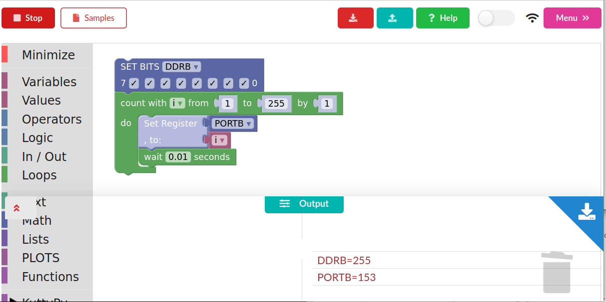

# Visual Programming Interface

!!! tip "Launching the visual coding browser"
	open the KuttyPy IDE, and click the `Online Compiler/Visual` button at the bottom.
	This will create a server on port 5000, display the IP address on the button, and open a web browser with the interface. 
	
	

## The web browser tab

+ The toolbar on the left side has all the coding blocks you will need
	  + It also has `undo`/`redo` icons
+ The top toolbar has
	+ A `run` button . which changes to `stop` while the code runs.
    + A samples button which opens a list of example codes
    + Save to archive(temporary storage) and Load from Archive
    + Help (You can edit/view instructions for sample codes here)
    + Ignore this
+ Menu
    + Save file
    + Open file(wont work yet)

The output is a slide-up window which displays results, plots, updated register values etc.  

!!! warning "TODO"
	The interface is quite fast over localhost, but feels slow over intranet. need to figure out bottlenecks. Once this is done, the server can be hosted on a small raspberry pi and the kuttypy device can be made completely wireless and controllable over the network.