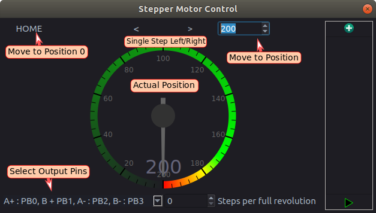
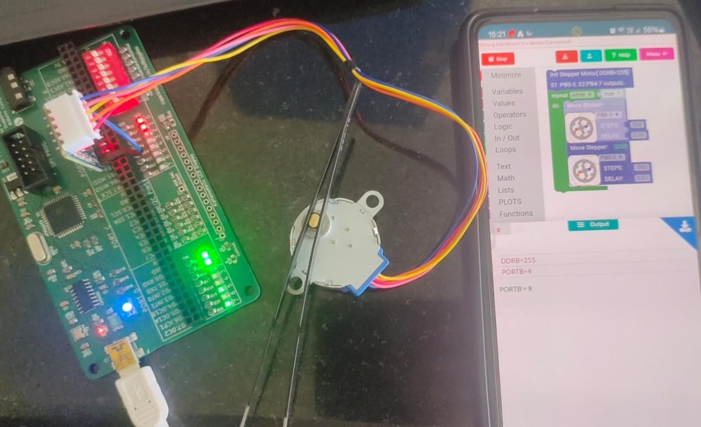
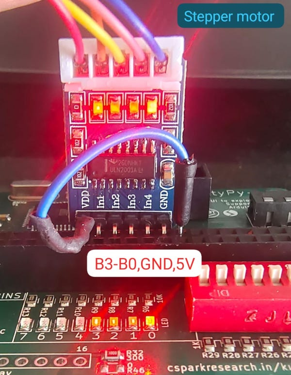

# Built-in stepper motor sequence generator

Stepper motors move by taking precise steps. This means that the controller can move to a defined
position, and back to the starting position without errors. Motors can have large step sizes (20 steps per revolution), or very small (600/rev)


The kuttypy GUI can generate a full step sequence for controlling 4 wire stepper motors via PB0-PB3 pins.
Since the current driving capability of the ATMEGA32 is somewhat limited, it is
advisable to use a push-pull driver IC such as the L293D with larger motors.



## Procedure

- Launch the window from the menu on the bottom right side of the screen
- Connect 4 wire, 2 phase stepper motor's A+,B+,A-,B- to PB0, PB1, PB2, PB3
- use the left and right arrow buttons to take single steps
- home button to return to original position
- the numeric entry field to move to a different position

## Video of the stepping sequence
LEDs are connected to PB0-PB3 to show the stepping signal outputs

<video controls width="600">
    <source src="../images/stepper.webm"
            type="video/webm">
    Sorry, your browser doesn't support embedded videos.
</video>

## Applications

- Move a light sensor (TSL2561) along a diffraction pattern, and record the intensity profile
- Rotate the analyzer in a [Malus's law experiment](../malus), and record the intensity variation which corresponds to IoCos^2(Theta)$ 


# C Code for controlling

We'll be using the 28BYJ-48 stepper motor and its controller. It is unipolar.
B0 to B3 pins will be set as output, and the stepping sequence will be applied to
these pins.



The motor driver




```python
#include<avr/kp.h>

#define DELAY 5
#define STEPS 200
int main (void)
  {
DDRB = 15;  //For controlling the stepper motor
uint8_t steps[]={0b1100,0b0110,0b0011,0b1001}; // 12,6,3,9
uint16_t pos = 0;
  for(;;)
	{
	for(pos=0;pos<STEPS;pos++){
		PORTB=steps[2];
		delay_ms(DELAY);
		PORTB=steps[1];
		delay_ms(DELAY);
		PORTB=steps[0];
		delay_ms(DELAY);
		PORTB=steps[3];
		delay_ms(DELAY);
		}
	for(pos=0;pos<STEPS;pos++){
		PORTB=steps[0];
		delay_ms(DELAY);
		PORTB=steps[1];
		delay_ms(DELAY);
		PORTB=steps[2];
		delay_ms(DELAY);
		PORTB=steps[3];
		delay_ms(DELAY);
		}
  }
return 0;
}
```


## Stepping Sequence

```commandline
// Connect pins B0 to B3 for the motor driver input.

wave drive sequence
Step   B0  B1  B2  B3   Decimal
  1     1   0   0   0      1
  2     0   1   0   0      2
  3     0   0   1   0      4
  4     0   0   0   1      8
  5     1   0   0   0      1  (Repeat)


Full Step

Step   B0  B1  B2  B3   Decimal
  1     1   1   0   0      3
  2     0   1   1   0      6
  3     0   0   1   1     12
  4     1   0   0   1      9
  5     1   1   0   0      3  (Repeat)


Half Step  ( used in the C code below )

Step   B0  B1  B2  B3   Decimal
  1     1   0   0   0      1
  2     1   1   0   0      3
  3     0   1   0   0      2
  4     0   1   1   0      6
  5     0   0   1   0      4
  6     0   0   1   1     12
  7     0   0   0   1      8
  8     1   0   0   1      9
  9     1   0   0   0      1  (Repeat)

```