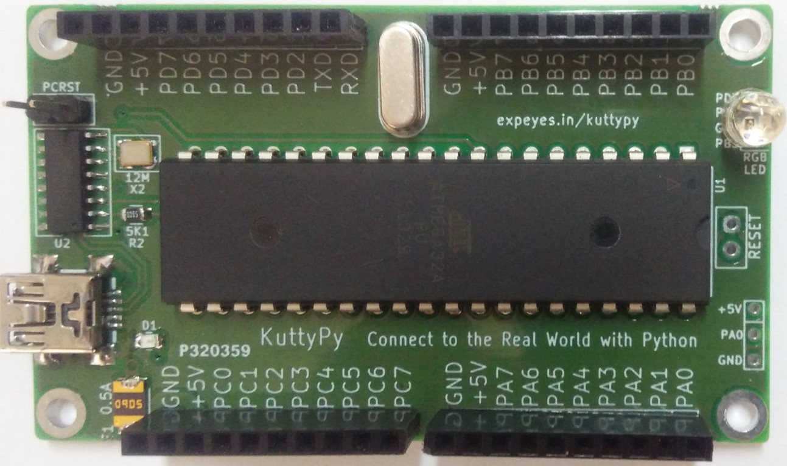

`Tutorial for learning to use KuttyPy in a 2 hour workshop session`

!!! info ""
	

## Software Installation 

Given the paucity of time, the fastest ways for installing the toolchain on different operating systems are listed. Click to expand.

??? abstract "Windows with Python3 installed"
    * Python3 must be installed, and `pip` should be accessible.
    * Open a command prompt, and use pip3 to install the KuttyPy package
    ```
    py -3 -m pip install KuttyPy
    ```
    * Download and install the [CH341 USB Driver](../assets/CH341SER.EXE)
    * You will now be able to launch `kuttypy` from the prompt, and import the `kuttyPy` library from any Python script.
    * If you wish to compile C code and upload to the KuttyPy hardware, winavr must be installed, and `avr-gcc` must be accessible from a command prompt.
        * Download and install `winavr` from [winavr.sourceforge.net](https://sourceforge.net/projects/winavr/files/WinAVR/20100110/WinAVR-20100110-install.exe/download)

??? abstract "Ubuntu"
    * Download the [deb file from here](../assets/KuttyPy-1.0.6.deb)
    * Navigate to the Downloaded deb file location, and install it. This also fetches dependencies : scipy, qtconsole, avr-gcc etc
    ```
    sudo apt install ./KuttyPy-1.0.6.deb 
    ```
    * launch the kuttyPy GUI from the command prompt using the command
    ```
    kuttypy
    ```
    It is also present in the applications menu as `KuttyPy GUI` .
    
    * You should see a graphical interface which looks like this
    
??? abstract "Using PIP on other OSes"
    * Python3 must be installed
    * Open a command prompt, and use pip3 to install the KuttyPy package
    ```
    pip3 install KuttyPy
    ```
    * You will now be able to launch `kuttypy` from the prompt, and import the `kuttyPy` library from Python.
    * If you wish to to compile C code, `avr-gcc` must be accessible from a command prompt. Install it from the package manager of your OS.

    ???warning "setting permissions on Linux based systems "
    	Accessing the hardware on linux requires certain permissions to be set.
	    Due to an apparent bug with pip3, the install script may fail to do this.

	    As a workaround, you can run the program as root to verify the permissions issue
	    ```
    	sudo kuttypy
    	```
    	For a more permanent fix for regular users, please download and execute this
    	[post installation script](../assets/postinst.sh)
    	
    	```bash
    	chmod +x postinst.sh
    	sudo ./postinst.sh
    	kuttypy
    	```
    
    
???abtract " Installing from source code " 
    ```bash
    sudo apt install python3-serial python3-pyqt5 python3-pyqt5.qtsvg gcc-avr avr-libc python3-qtconsole python3-scipy python3-pyqtgraph
    git clone http://github.com/csparkresearch/kuttypy-gui
    cd kuttypy-gui
    python3 KuttyPyGUI.py
    ```
    For setting hardware permissions, refer to the previous section


## KuttyPy Software

???+ success "Screenshot of the Graphical interface after launching `kuttypy` "
    
    The title will show `Hardware not Detected` if not connected, or if a permissions issue exists

### Explore the functions

* You have already noticed that the User Interface(UI) resembles the kuttyPy board. 
* It has four ports `PORTA, B , C, D` with 8 pins each, and pin has a row representing it: 
---
* Each Pin is configured as an input by default, and the RED coloured box next to it indicates the input is `LOW` or near 0 Volts.
    * If the input is `HIGH`, which can be accomplished by connecting it to 5V, or enabling the `pull-up` checkbox, the RED box will turn to `GREEN`
    * Since the inputs are `floating`, merely touching the pins with your fingers will cause the inputs to fluctuate between `RED` and `GREEN` status. 
---
* Each pin can be reconfigured as an `OUTPUT` type by clicking on the `INPUT` button next to it.
    * Make any of the pins `PD5`, `PD7`, or `PB3` an output type, and click on its square RED button to set it to `HIGH`. These pins are connected to the RGB LED on the board, so the LED will glow!
---    
* Some pins have additional functionality:
    * Analog to Digital Convertor enabled inputs: 
        * All pins on `PORTA (PA0 - PA7)` for this microcontroller have a 10-bit ADC functionality. 
        * Make it an `OUTPUT`, and click again to see a variable slider and an LCD number show a value between 0-1023  
        * You can use this as an [8 channel, 0-5V voltmeter](../adc) for testing analog joysticks, sensors etc.  Click on the LCD number to reveal a guage and data logger!
    * PWM outputs. PB3, PD5, PD7 . Adjust the RGB LED intensity using the sliders. 
    
    
---
* [I2C Sensors](../sensors) for a range of physical parameters such as pressure, acceleration etc can be connected using PC0(SCL), and PC1(SDA).

!!! tip "Stuff seems to be working?"
    Now that we have skimmed over the basics of the graphical utility's `playground`, it would appear that the board itself is capable
    of controlling real-world events. For further details on the hardware schematic, [visit the page](../hw/) .
    
    The pinout diagram will be very useful although the board itself is well labelled. The ATMEGA32 datasheet will be handy as well.

---

## Hello World

Programs executing on Microcontrollers use [special function registers(SFRs)](../programming/basics) to manipulate the hardware(Inputs, outputs, ADCs etc). 
These are basically predefined variables, where each bit is associated with a hardware change.

setReg and getReg Python function calls in the kuttyPy library can be used to read and write these registers.
Here's an example. Run it in a python3 shell. 

```python
from kuttyPy import * #Import the library. also automatically connects to any available kuttypy hardware.
setReg('DDRD',160) #0b10100000 PD7(BLUE LED) and PD5(GREEN LED) made output type
setReg('PORTD',160) # PD5 and PD7 set to HIGH. Both LEDs start glowing. Colour looks like cyan.
```

For detailed examples, visit the [python coding page](../programming/intro).

We will continue from the [I/O examples](../programming/basics) page

