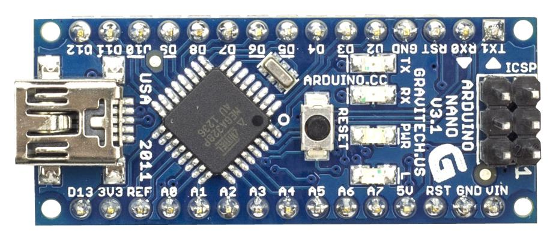
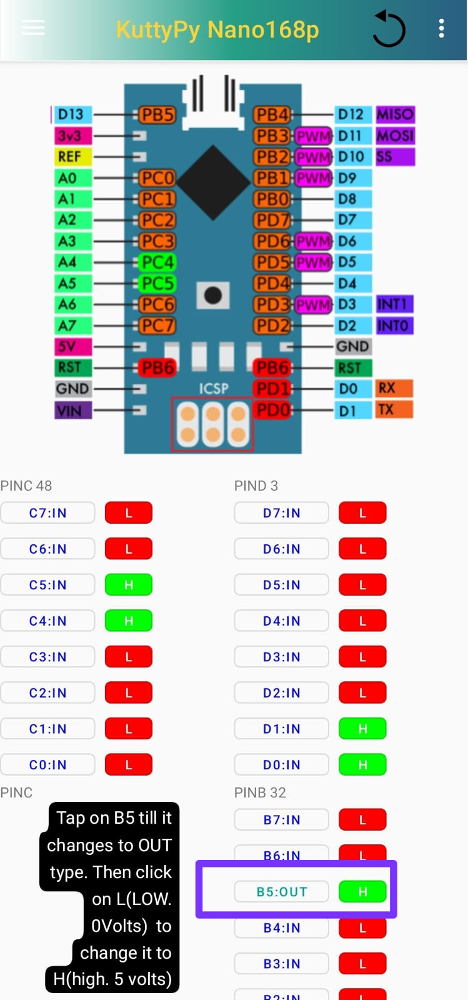
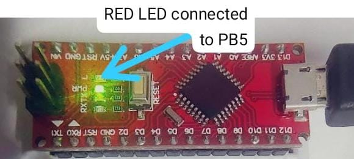
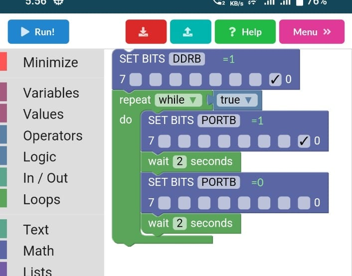
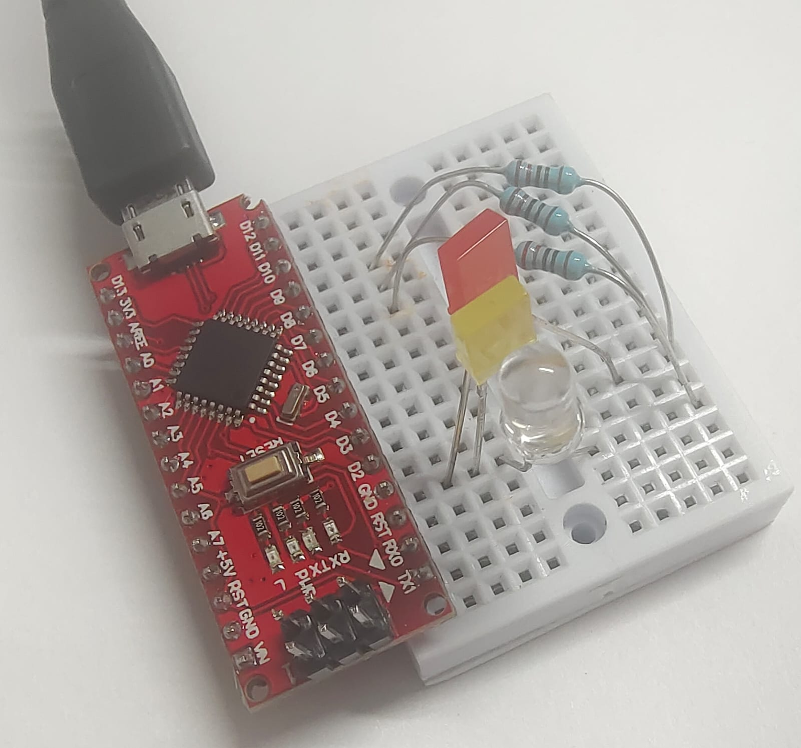
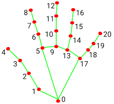
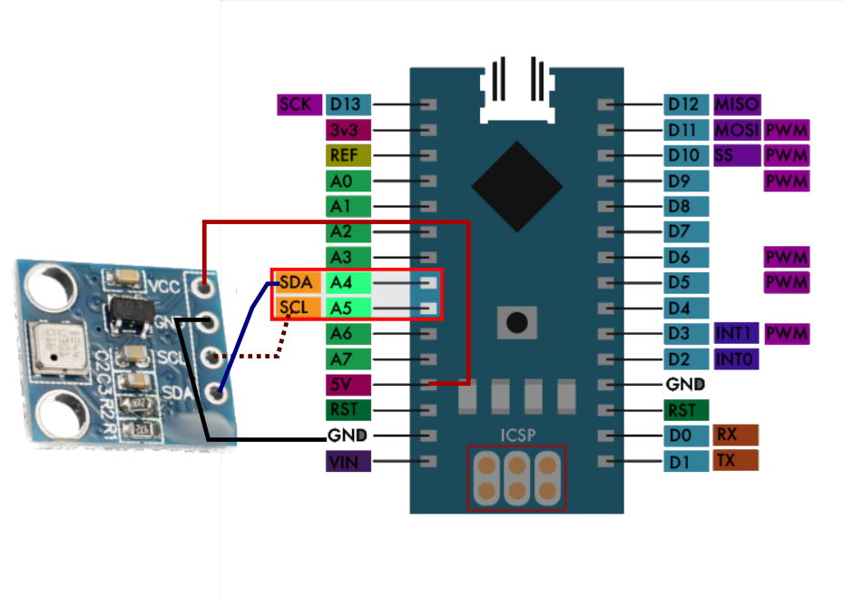

`Tutorial for learning to use KuttyPyNano - A Python to real world bridge`

!!! info "Intended audience"
	* Beginners who would like to explore microcontroller functions via Python without the compile+upload hassle.
	* Hobbyists who want a way to control external parameters such as lights, fans, and [robots](../programming/intro/#slightly-complex-example) from their Python programs
	* Scientists who want to use affordable and [easily available sensors](../sensors) for physical parameters( temperature, humidity, pressure...) without having to learn embedded systems and communications.
	
	
!!! info ""
	{: style="align:center;max-width:400px"}

## Software Installation 

Download the kuttypy app from the google playstore.

## Hello World

This workshop will introduce you to the following basics of how to use a microcontroller to automate everyday
tasks. They will use the android app to change values of bits (0s and 1s) in various registers 
via a friendly graphical interface, and enable you to observe the corresponding behaviour of the hardware
in real-time. No Compiling/Uploading of code is planned, and all input/output tasks are via the phone.

### Explore the playground

Once you connect a KuttyPy nano to your phone via USB OTG cable, the titlebar should turn green
in colour and show the KuttyPy nano's picture below it. If not, close the app and try again.

Click the playground.

Here you will find a picture showing the pin numbers, and also the associated register+bit notation of that
pin. 

For example, D13 is labelled as PB3. This means that the output pin of the microcontroller which is 
connected to D13 is controlled by the 3rd bit of the B register.

!!! info ""
    PB5 is also connected to the Fourth LED (Red) of the board, so turning it on will light up this LED.

### Connect MORE LEDS

Similarly, you can also connect LEDs to other pins such as  D2 (PD2), D3, D4... D12. 

Let us try to use D8 (PB0) . Connect a 1Kohm (1000 ohms) resistor from D8 pin to the longer leg(+) of an
LED. You can use a breadboard to make these connections as shown. Then the shorter leg of the LED(-) should
be connected to GND to complete the circuit.

Now tap on PB0 in the playground, and change the output level from L to H to light up this LED.

!!! tip ""
	When the pin is shown as IN type in the playground, the L/H icon indicates the state of the pin
	in input mode. If voltage on the pin is near 0 Volts, it is L, and if it is above 3 Volts, it is H.

## What are registers, and how to blink an LED

We shall now learn to write programs.

### Getting Started

+ `Go to Visual Programming -> Getting Started -> Hello World`

The program shown has 2 parts. 

+ A print block : This prints(displays on the screen) the value of anything connected to it.
+ A label whose value is set to `hello`

You will find a blue button called 'RUN' at the top left corner. This is used to run your simple program.
Click it .

Click it again to close the results window, and edit your program.

There are also buttons to temporarily save and restore your work, and also a `help` button for instructions.

On the left are various components you can use to design your program

### Blink an LED
The LED you connected to PB0 (D8) will again be used .
+ `Go to Visual Programming -> KuttyNano -> Blink LED`

Observe this program carefully

+ the 0th bit(Right-Most) of DDRB(Data Direction Register for B) is selected (Set to 1).
+ This means that PB0 is is now configured as an output. you can connect LEDs and other small loads to it.
+ A `while` loop with the condition set to `true` is added below it
  + Anything inside a while loop will run in a loop continuously as long as the condition is `true`.
  + The 0th bit of PORTB( Used to set the voltage level of output pins) register is selected.
  + Now the LED should be on, so we wait for 2 seconds so you can see it is ON.
  + Then the 0th bit is made 0, so PB0 will be set to 0Volts.
  + So the LED will be off, and we now wait another 2 seconds.
  + The cycle of On OFF will keep repeating forever until you abort the program.

### Traffic Lights

We will use 3 LEDs in this demo, and light them up one by one to show a traffic light signal.

### AI control using gestures

+ `Go to Visual Programming -> Visual Demos -> AI LED`

Downloading for AI assets is around 10MB, so wait for the download to complete after you
grant permissions to use the selfie camera.

Once you are able to see yourself in the screen, raise your hand, and observe the algorithm
detecting the various joints in your fingers. Each joint is labelled as shown below

+ This program lights up the Onboard LED (PB5) if the index finger is extended
+ To check this, we use the `is Index Finger Extended?` logic block which returns `true` if it is, and `false` if not
+ It checks where the Y coordinate of joint 8 is more than the Y coordinate of joint 6. 
+ So when you fold your finger, 8 comes below 6, and the LED is turned off since the condition is `false`

### AI Piano

Flex fingers one by one to play different notes on a virtual piano.

### AI Hand gestures

We will plot a graph of the distance between the tip of the thumb to the tip of the index finger .

## Sensors using I2C communication

* [I2C Sensors](../sensors) for a range of physical parameters such as pressure, acceleration etc can be connected using SCL and SDA pins.
* Use the Data Logger interface to scan for sensors and view readings
* Explore potential applications.

### Pressure measurement with BMP180

In the soldering workshop, you will have connected 4 pins to a BMP180 pressure sensor. We will now learn to use it.

+ This sensor uses 2 pins to exchange data with your kuttypynano
+ SDA (PC4 / A4) : For data
+ SCL (PC5 / A5) : Clock for synchronizing data
+ You also need to connect 5V and GND for power supply to your sensor.
+ Total Connections are as follows
  + 5V -> VCC
  + GND -> GND
  + SCL -> SCL
  + SDA -> SDA

## Basic C code

This is not covered in this tutorial, but a precompiled code for blinking LEDs on pins PD0-PD6 is
part of the app. To upload this code to your device, go to the home page, and click the menu at the top 
right corner

+ Upload HEX ->LED Display 328p
+ Click on the menu again, and click on disconnect.
+ Your program is now running. :)